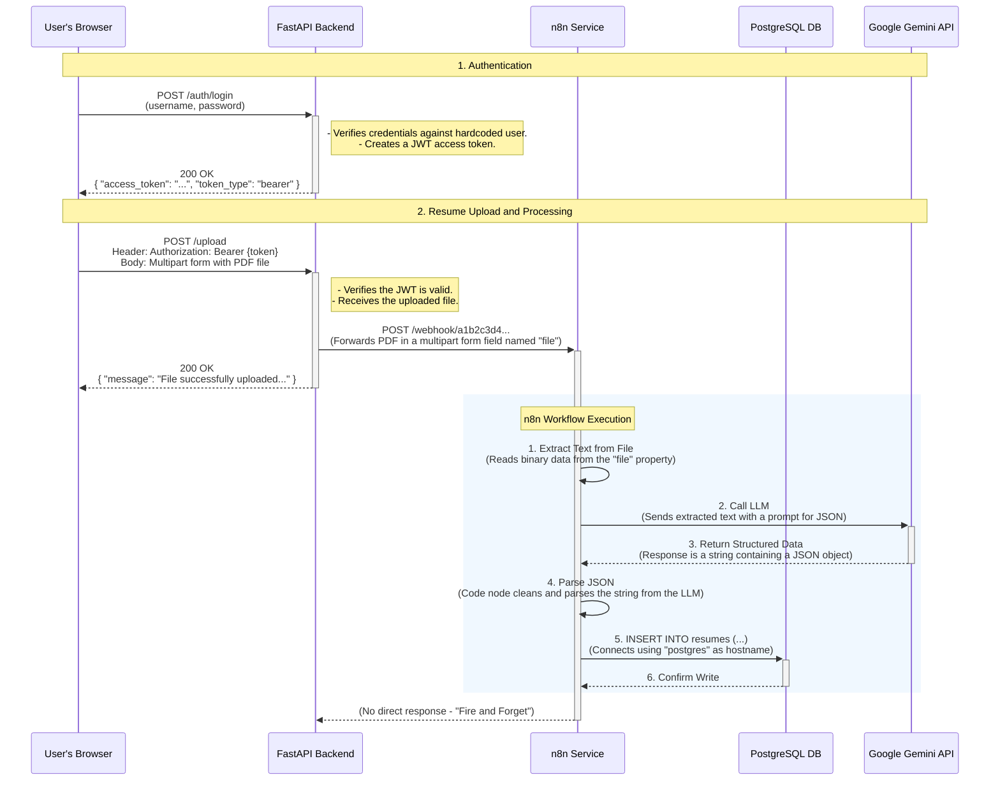

# n8n-Driven Resume Analyzer

This project is a secure, containerized, AI-powered system that automates the process of parsing and analyzing PDF resumes. It provides a secure API endpoint to upload a resume, which triggers an n8n workflow to extract key information and store it in a PostgreSQL database.

## Architecture

The system consists of the following services orchestrated by Docker Compose:

* **FastAPI Backend:** A Python backend that handles authentication, file uploads, and triggers the n8n workflow.
* **n8n:** An automation platform that processes the resume, extracts information using Google Gemini, and inserts it into the database.
* **PostgreSQL:** A database to store the structured resume data.
* **pgAdmin:** A web-based administration tool for PostgreSQL.
  


## Prerequisites

* Docker & Docker Compose
* `curl` or an API client like Postman for testing

## Setup

1.  **Clone the Repository:**
    ```sh
    git clone <repository-url>
    cd resume-analyzer
    ```

2.  **Review Environment Variables:**
    This project includes a pre-configured `.env` file for ease of testing. Please review this file to ensure the values are correct for your environment, especially your `GOOGLE_AI_API_KEY`.


## Running the Application

1.  **Start all services:**
    Run the following command from the project root to build and start the containers in detached mode.
    ```bash
    sudo docker compose up --build -d
    ```

2.  **Verify services are running:**
    ```bash
    sudo docker compose ps
    ```

## Usage & Testing

Since there is no frontend, you can test the API endpoints using `curl`.

1.  **Get an Authentication Token:**
    The backend uses a hardcoded user for authentication. Use the following command to get a JWT.
    ```sh
    curl -X POST "http://localhost:8000/auth/login" -H "Content-Type: application/x-www-form-urlencoded" -d "username=testuser&password=testpassword"

    ```

2.  **Upload a Resume for Analysis:**
    With the token provided from the above command, you can now upload a PDF file to the secure endpoint. Replace `cv.pdf` with the actual resume PDF file and also make sure you are running this command from the directory where 'cv.pdf' is located.
    ```sh
    curl -X POST "http://localhost:8000/upload" -H "Authorization: Bearer YOURTOKENHERE" -F "file=@cv.pdf"

    ```
    On success, this will return `{"message": "File uploaded and sent to workflow successfully."}`.

3.  **Verify the Result in the Database:**
    - Navigate to the **pgAdmin UI** at `http://localhost:5050`.
    - Log in with the credentials from your `.env` file. (username: admin@example.com, password: admin)
    - Connect to the `resume_analyzer_db` and query the `resumes` table to see the newly inserted structured data.

## Accessing the Services

* **Backend API Docs:** `http://localhost:8000/docs`
* **n8n UI:** `http://localhost:5678`
* **pgAdmin UI:** `http://localhost:5050`
    * **Username:** as defined in `PGADMIN_DEFAULT_EMAIL`
    * **Password:** as defined in `PGADMIN_DEFAULT_PASSWORD`

## Project Structure

````

resume-analyzer/
├── backend/
│   ├── main.py
│   ├── auth.py
│   ├── upload.py
│   ├── requirements.txt
│   └── Dockerfile
├── n8n-data/
│   └── workflows/
│       └── resume\_analyzer.json
├── .env
├── docker-compose.yml
└── README.md
