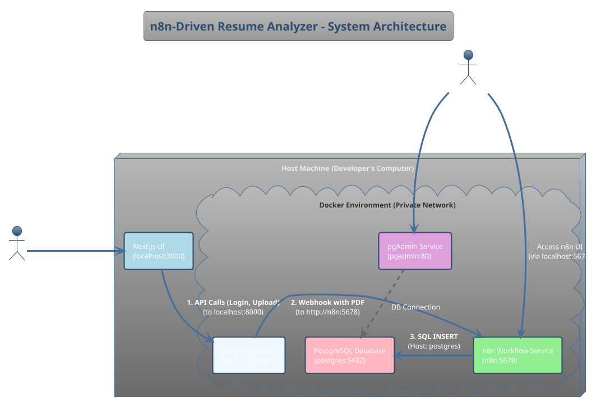

Of course. Here is a highly detailed project blueprint document. It consolidates our entire discussion, outlines the architecture, specifies the rules, and provides a clear path for a developer to build the project from its current state.

---

## **Project Blueprint: n8n-Driven Resume Analyzer**

**Document Version:** 1.0
**Date:** June 21, 2025

### 1. Project Overview & Goal

The primary objective is to build a secure, containerized, AI-powered system that automates the process of parsing and analyzing PDF resumes. A user will upload a resume through a web interface, which will trigger a backend process to extract key information using an n8n workflow and store the structured data in a PostgreSQL database.

The entire system must be orchestrated using Docker Compose and follow strict security and code structure guidelines.

**Core Technology Stack:**
*   **Backend:** Python (FastAPI)
*   **Automation:** n8n
*   **AI Model:** Google Gemini
*   **Database:** PostgreSQL
*   **Containerization:** Docker & Docker Compose
*   **Frontend (User-facing):** Next.js

### 2. Current Project Status

As of this document's creation, significant progress has been made on the automation component, but all other components must be built from scratch.

*   **COMPLETED:**
    *   **n8n Workflow Design:** A complete workflow has been designed, built, and tested on the n8n cloud platform. This workflow successfully receives a binary file, extracts text, uses a Gemini prompt to extract structured JSON, parses the result, and is ready for database insertion.
    *   **Database Credential Definition:** All necessary credentials for the PostgreSQL database have been defined and are ready for use.

*   **TO BE BUILT:**
    *   The FastAPI backend application.
    *   The complete Docker setup (`docker-compose.yml`, backend `Dockerfile`).
    *   The PostgreSQL database schema initialization.
    *   The Next.js frontend for user interaction.
    *   The final `README.md` and project documentation.

### 3. Core Architecture & Data Flow

The system operates on a "fire and forget" principle where the backend offloads processing to the n8n service. All services will run in a private Docker network.

**Architectural Diagram:**


**Step-by-Step Data Flow:**
1.  **Authentication:** The user logs in via the Next.js UI. The UI sends credentials to the FastAPI backend (`/auth/login`) and receives a JWT.
2.  **Upload:** The user uploads a PDF. The Next.js UI sends the file and the JWT to the secured FastAPI endpoint (`/upload`).
3.  **Handoff:** The FastAPI backend validates the JWT, receives the file, and immediately makes a `POST` request to the n8n webhook URL (`http://n8n:5678/...`), sending the raw PDF data. The backend's job for this request is now done.
4.  **Processing:** The n8n workflow executes: it extracts text, calls the Gemini API with a specific prompt, parses the structured JSON response, and prepares the data.
5.  **Storage:** The `Postgres` node within the n8n workflow connects directly to the PostgreSQL container (using the service name `postgres` as the host) and inserts the structured data into the `resumes` table.
6.  **Verification (Developer):** The developer can access the `pgAdmin` service in their browser (`http://localhost:5050`) to view the database and verify that the record was created successfully.

---

### 4. Build Instructions & Component Specifications

#### 4.1. Project Structure (MANDATORY)
The developer must adhere to this exact directory structure at the root of the project.

```
resume-analyzer/
├── backend/
│   ├── main.py
│   ├── auth.py
│   ├── upload.py
│   ├── requirements.txt
│   └── Dockerfile
├── workflows/
│   └── resume_workflow.json
├── docker-compose.yml
├── .env
└── README.md
```

#### 4.2. Environment Variables & Secrets (`.env`)
Create a `.env` file at the project root. It will contain all secrets and configurations. **This file MUST NOT be committed to Git.**

```env
# .env

# === n8n Configuration ===
# The GOOGLE_AI_API_KEY for the Gemini model
GOOGLE_AI_API_KEY=your_secret_gemini_api_key

# === Backend Configuration ===
# The full webhook URL for n8n. The service name 'n8n' is used, not 'localhost'.
N8N_WEBHOOK_URL=http://n8n:5678/webhook/your-production-webhook-id

# A secret key for JWT token generation
JWT_SECRET_KEY=your-super-strong-secret-key-for-jwt

# === Database Credentials ===
# Used by Postgres, n8n, and pgAdmin services
POSTGRES_USER=postgres
POSTGRES_PASSWORD=mysecretpassword
POSTGRES_DB=resume_analyzer_db

# === pgAdmin Configuration ===
# Login credentials for the pgAdmin web interface
PGADMIN_DEFAULT_EMAIL=admin@example.com
PGADMIN_DEFAULT_PASSWORD=admin
```

#### 4.3. n8n Workflow (`workflows/resume_workflow.json`)
The workflow is already designed. The developer's task is to export it and place it in the correct directory.
*   **Action:** Log into the n8n cloud account where the workflow was built. Download the workflow JSON file.
*   **Placement:** Place the downloaded file at `workflows/resume_workflow.json`.
*   **Key Configuration Points (for reference):**
    *   **Trigger:** A Webhook node, set to `POST` and `Immediately` response mode.
    *   **Text Extraction:** An `Extract from File` node configured for PDF.
    *   **AI Call:** A `Google AI` node using the Gemini model, with a detailed system prompt and `JSON Mode` enabled.
    *   **Parsing:** A `Code` node to clean and parse the JSON string from the AI's `text` output.
    *   **Database Insertion:** A `Postgres` node configured with the credentials defined in **section 4.2**.

#### 4.4. Database Schema (PostgreSQL)
The `postgres` service in Docker will initialize a database. The backend application (or a startup script) must ensure the following table exists.

**Table: `resumes`**
```sql
CREATE TABLE resumes (
    id SERIAL PRIMARY KEY,
    filename TEXT,
    full_name TEXT,
    email TEXT,
    phone TEXT,
    skills TEXT[],
    experience_years FLOAT,
    last_job_title TEXT,
    uploaded_at TIMESTAMP WITH TIME ZONE DEFAULT CURRENT_TIMESTAMP
);
```

#### 4.5. Backend Implementation (FastAPI)
The developer will build the FastAPI application inside the `backend/` directory.

*   **`requirements.txt`:** Must include `fastapi`, `uvicorn`, `python-jose[cryptography]`, `passlib[bcrypt]`, `python-multipart`, and `requests`.
*   **`auth.py`:**
    *   Implement `POST /auth/login`.
    *   It must **not** connect to the database. Use a hardcoded user/password for validation.
    *   On success, it must generate and return a valid JWT.
*   **`upload.py`:**
    *   Implement `POST /upload`.
    *   This endpoint must be secured and require a valid JWT from the `/login` endpoint.
    *   It should accept a file upload (`UploadFile`).
    *   Its sole responsibility is to make a `POST` request to the `N8N_WEBHOOK_URL` (from the `.env` file), sending the PDF file's content as binary data (`application/octet-stream`).
*   **`Dockerfile`:** Create a standard Python Dockerfile that installs requirements and runs the app with `uvicorn`.

#### 4.6. Docker Orchestration (`docker-compose.yml`)
This is the central file for running the entire system.

*   **Define 4 Services:** `backend`, `n8n`, `postgres`, `pgadmin`.
*   **`backend` Service:**
    *   Build from the `backend/` directory.
    *   Expose port `8000`.
    *   Pass the `N8N_WEBHOOK_URL` and `JWT_SECRET_KEY` as environment variables.
*   **`n8n` Service:**
    *   Use the official `n8nio/n8n` image.
    *   Expose port `5678`.
    *   Use volumes to mount the `workflows/` directory.
    *   Pass all necessary environment variables from the `.env` file (`GOOGLE_AI_API_KEY`, all `POSTGRES_*` variables for the credential).
*   **`postgres` Service:**
    *   Use the official `postgres:latest` image.
    *   **DO NOT** expose any ports. It must only be accessible from within the Docker network.
    *   Use volumes to persist the database data.
    *   Pass the `POSTGRES_USER`, `POSTGRES_PASSWORD`, and `POSTGRES_DB` environment variables for initialization.
*   **`pgadmin` Service:**
    *   Use the official `dpage/pgadmin4` image.
    *   Expose a port like `5050` to the host.
    *   Pass the `PGADMIN_DEFAULT_EMAIL` and `PGADMIN_DEFAULT_PASSWORD` environment variables.

### 5. Development Rules & Best Practices

1.  **Secrets Management:** **ZERO** hardcoded secrets (API keys, passwords, JWT secrets) are allowed in the source code. All secrets must be loaded from the `.env` file.
2.  **Docker Networking:** All communication between containers **MUST** use the Docker service names as hostnames (e.g., `http://n8n:5678`, `host: postgres`), not `localhost`.
3.  **Error Handling:** Implement basic error handling. If a JWT is invalid, return a `401 Unauthorized`. If the n8n webhook call fails, the backend should return a `500 Internal Server Error`.
4.  **README.md:** The final `README.md` must be comprehensive, providing clear, step-by-step instructions on how to set up the `.env` file and run the entire project with a single command (`docker-compose up`).

### 6. Final Deliverables

The final submission must be a single GitHub repository containing all specified files, and a 5-minute Loom video demonstrating the full, end-to-end functionality of the working application as described in the original project specification.